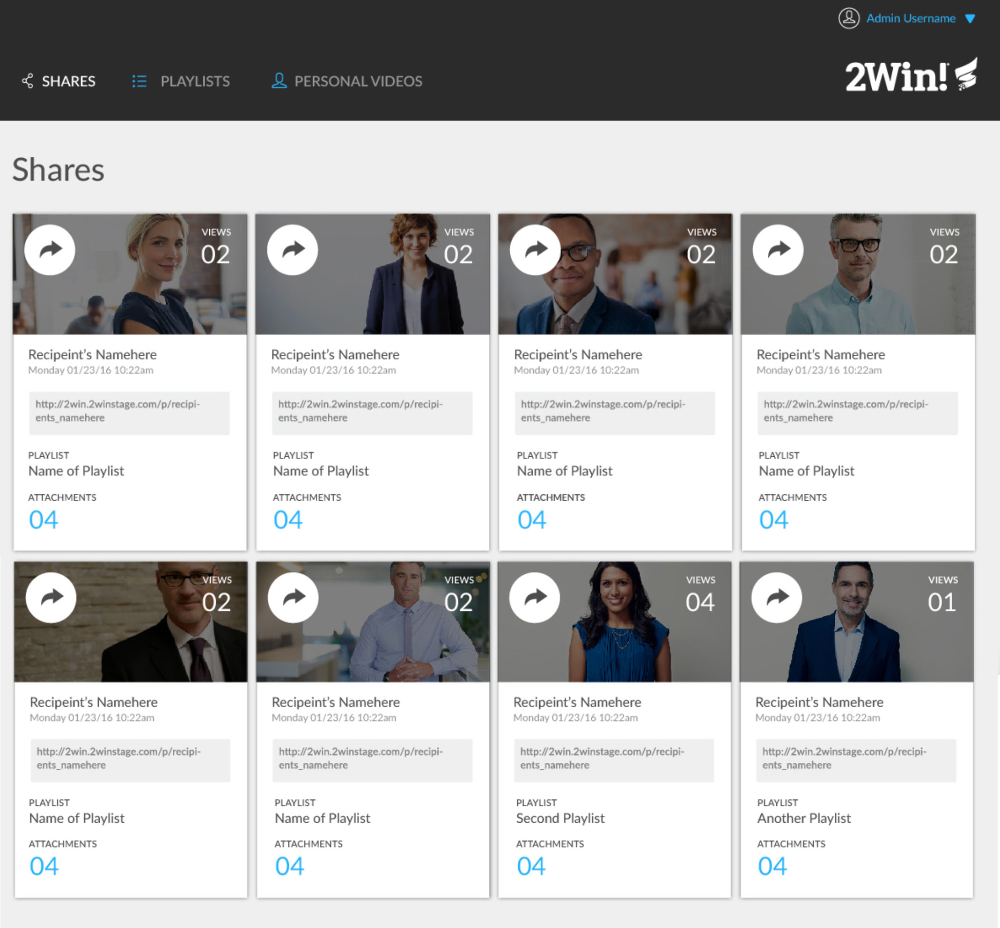
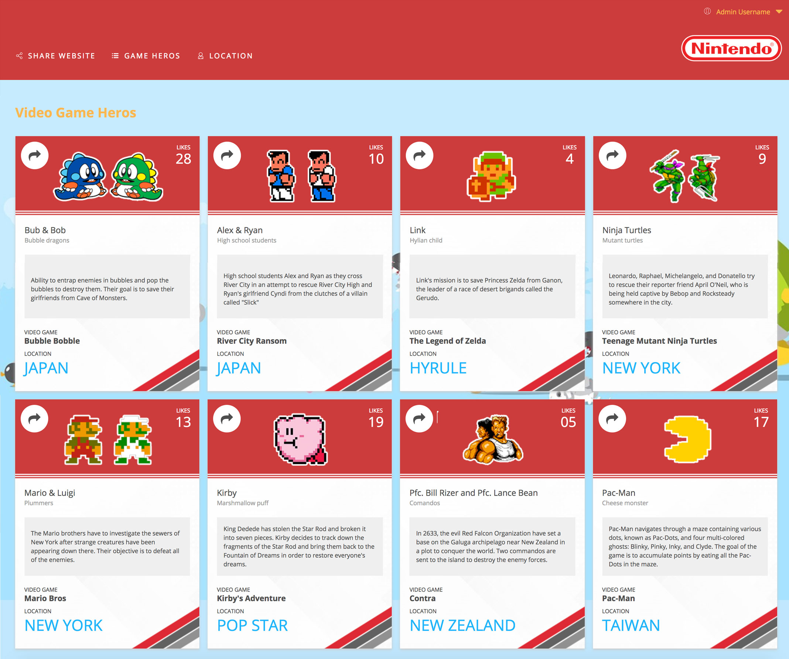

# tm-comp-challenge-2
Static Comp Challenge #2

I decided to start this static comp by duplicating the original design the best I could first so that I could get the layout as accurate as possible before starting on a new design. I decided to go with a Nintendo theme for no real reason besides thinking about my past love for video games before school and getting old.

I spent a lot of time trying to toggle the info on the card on the mobile view as well as toggle the share link which ended up being too much work to get it finalized in time. I used grid to format the cards because I wanted to learn something new instead of just using Flexbox.

